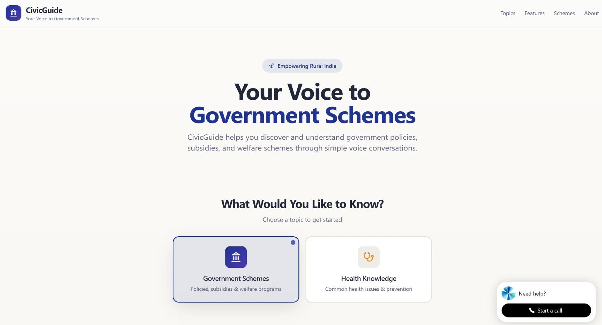
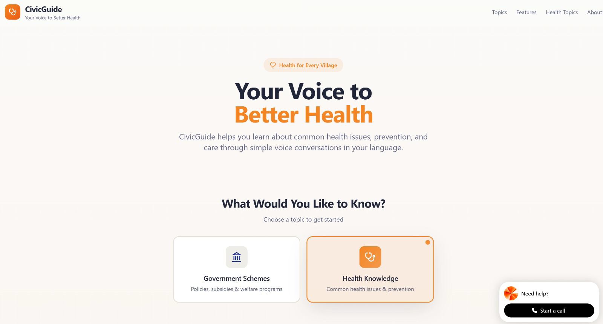
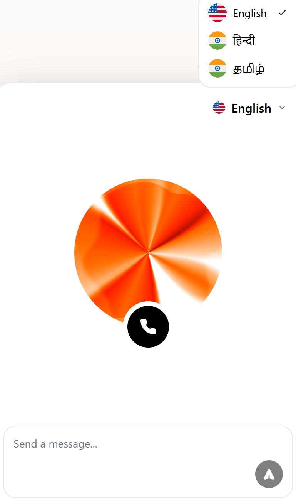
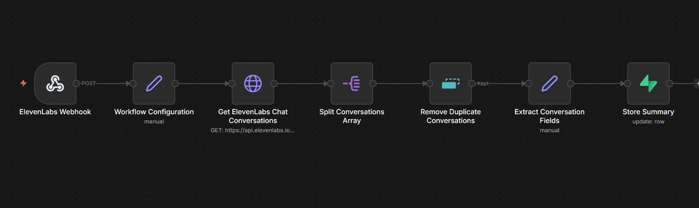

# 🎙️ Voice Assistant for Rural Accessibility

A voice-based assistant designed to improve digital accessibility for users in rural areas, enabling interaction with technology through simple speech commands instead of complex interfaces.

## 📌 Overview

This project focuses on bridging the digital divide by creating an intuitive voice interface that allows users to access information and services without needing advanced technical knowledge or literacy.

The assistant is designed to work in low-resource environments, making it suitable for rural and underserved communities.

---

## 🚀 Features

- 🎤 Voice-based interaction (no typing required)
- 🌐 Access to essential information (weather, general queries, etc.)
- 🧠 Simple and intuitive command processing
- 🔊 Audio responses for better accessibility
- 📶 Designed to work in low-connectivity scenarios (basic functionality)

---

## 🛠️ Tech Stack

- Python  
- Speech Recognition  
- Text-to-Speech (TTS)  
- Basic NLP processing  

---

## 🎯 Objectives

- Improve accessibility for non-technical users  
- Reduce dependency on text-based interfaces  
- Enable inclusive technology usage in rural areas  
- Provide a foundation for further expansion into multilingual and offline systems  

---

## 🔍 How It Works

1. User gives a voice command  
2. Speech is converted to text  
3. System processes the command  
4. Appropriate response is generated  
5. Response is converted back to speech  

---

## 📈 Future Improvements

- 🌍 Multilingual support (regional languages)  
- 📡 Full offline functionality  
- 🤖 More advanced NLP for better understanding  
- 📱 Mobile integration  
- 🔗 Integration with government/local services  

---

## 🤝 Contribution

This project is open to ideas and improvements. Contributions are welcome!

---

## 📄 License

This project is open-source and available under the MIT License.
